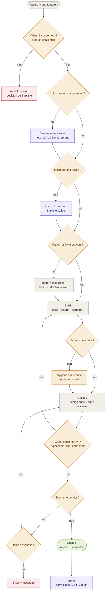
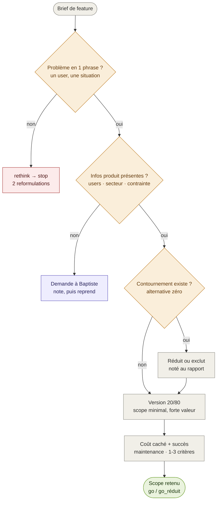
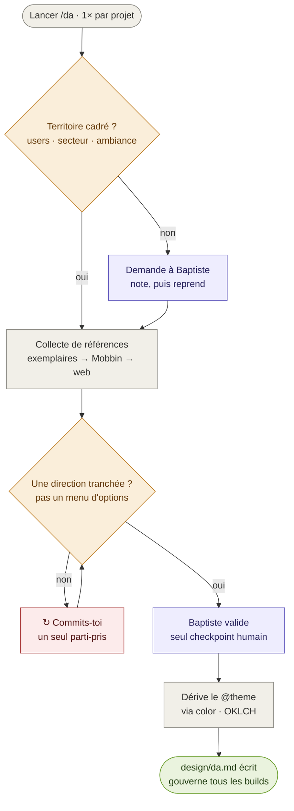
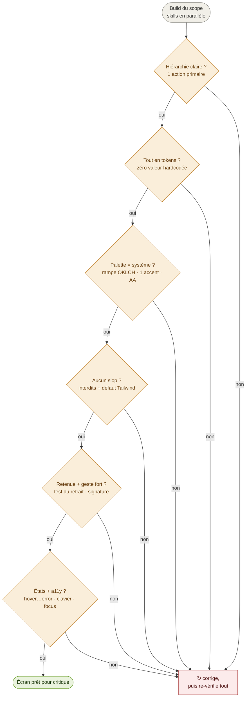
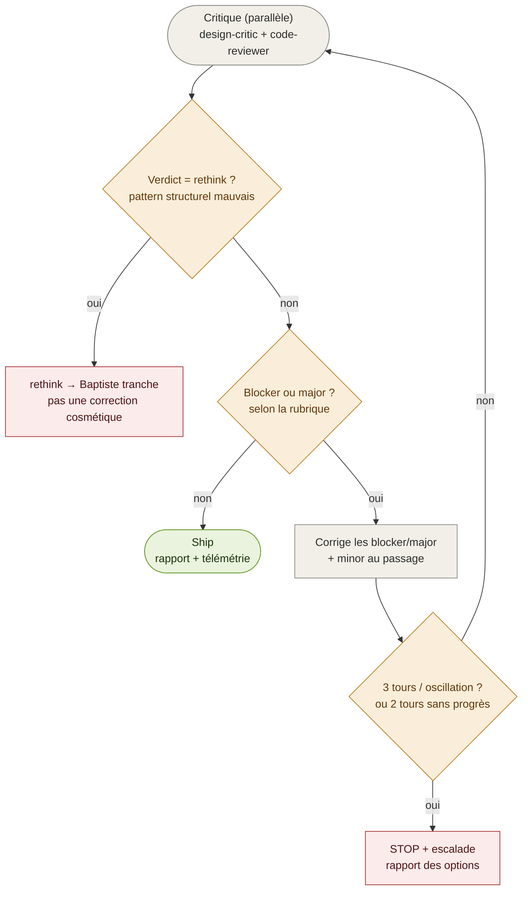

# Pipeline du Product Builder — arbres de décision

Doc vivante du fonctionnement du kit, en arbres de décision oui/non. Texte
(Mermaid) plutôt qu'images : diffable, rendu nativement par GitHub, et
amendable comme le reste du kit via `/retro`.

**Comment lire** — la colonne centrale est le chemin nominal ; à chaque losange,
la branche qui descend est la réponse qui continue le pipeline (parfois *oui*,
parfois *non*, toujours étiquetée). Les sorties latérales mènent à un stop, une
question à Baptiste, ou une action qui reprend ensuite le flux.

| Couleur | Sens |
|---|---|
| 🟡 ambre (losange) | Décision oui/non |
| ⬜ gris | Étape automatique |
| 🟣 violet | Checkpoint humain (Baptiste) |
| 🔴 rouge | Stop / escalade / correction |
| 🟢 vert | Validé / shippé |

---

## Vue d'ensemble — `/feature`

Le pipeline complet, du brief au ship. Un seul checkpoint humain dans tout le
flux : la direction artistique (`/da`). Deux boucles se ferment seules — les
gates machine qui renvoient au build, et la correction qui relance la critique
(plafond 3 tours, sinon escalade).

---

## 1. Challenge produit — `product-challenger`

Ne valide pas le brief : le réduit à sa version minimale à forte valeur, ou le
rejette. Première ligne de défense contre la feature inutile et le scope qui
enfle. Source : [`agents/product-challenger.md`](../product-builder/agents/product-challenger.md).

---

## 2. Direction artistique — `/da`

Le seul checkpoint humain du build. Collecte multi-sources (exemplaires du kit,
Mobbin, galeries web), puis on tranche **une** direction — pas un menu. Le
`@theme` du projet en dérive. Source : [`commands/da.md`](../product-builder/commands/da.md).

---

## 3. Build — les gates de goût

Le nœud « Build » éclaté en ses gates binaires. C'est ici que vivent les skills
`design-judgment`, `color`, `anti-slop`, `art-direction` et `a11y` : le goût est
devenu une suite de oui/non vérifiables, plus une intention vague. Un seul *non*
sur n'importe quel gate → on corrige avant de continuer, jamais on shippe.

Ces gates correspondent aux skills : [`design-judgment`](../product-builder/skills/design-judgment/SKILL.md) ·
[`color`](../product-builder/skills/color/SKILL.md) ·
[`anti-slop`](../product-builder/skills/anti-slop/SKILL.md) ·
[`art-direction`](../product-builder/skills/art-direction/SKILL.md) ·
[`a11y`](../product-builder/skills/a11y/SKILL.md).

---

## 4. Critique & boucle de correction

Les deux critics tournent en parallèle, puis le verdict décide : ship, corriger,
ou escalader. Seule boucle qui se ferme seule (plafond 3 tours). Le design-critic
re-teste les gates de goût du build (§3) : c'est la double barrière build-puis-audit.
Source : [`agents/design-critic.md`](../product-builder/agents/design-critic.md), [`commands/feature.md`](../product-builder/commands/feature.md).

---

## Amender cette doc

Ce sont des schémas, pas la source de vérité : les règles vivent dans les
commandes, agents et skills liés ci-dessus. Quand le pipeline change (via
`/retro`), mettre à jour le diagramme concerné ici dans le même commit — comme
pour la doctrine tokens, deux formulations divergentes finissent par coûter un
incident.
